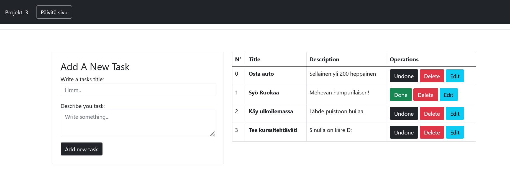

# Sovellusprojekti Nodejs, Express ja Mongodb



Tehtävä on suoritettu itsenäisesti oppimismallin mukaan. Opasteiden ja harjoittelun kautta koodi on kirjoitettu.
Samalla tuli opittua handlebars ja babelin käyttö.


### Asentaminen (ohje)


* Muista asentaa node express mongoose jos haluat itse kokeilla.

Jos haluat asentaa lisäohjelmat itsellesi niin ajaa seuraavasti koodia:
```
npm install
npm run build
npm start
```

Asennuksen jälkeen voit avata sovelluksen: `` http://localhost:3000 ``

